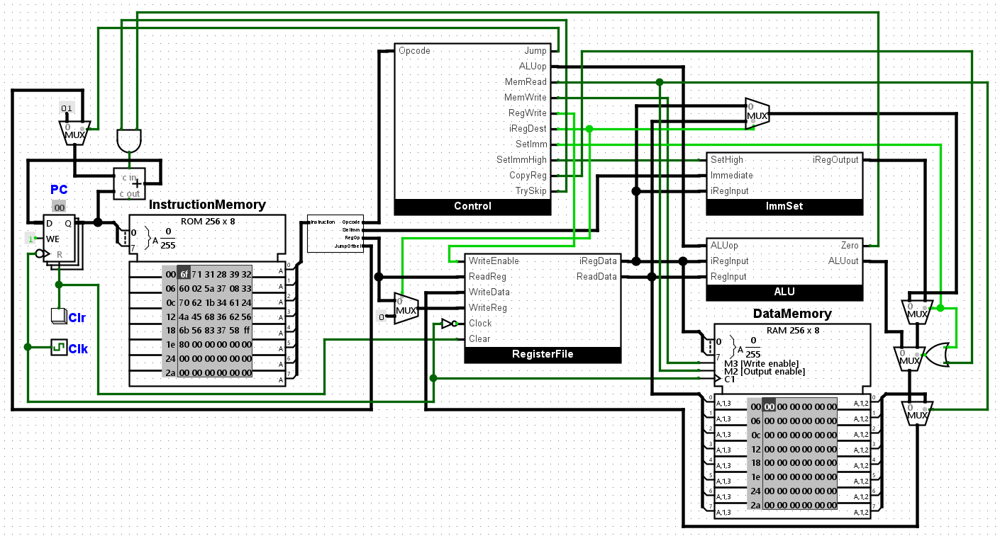
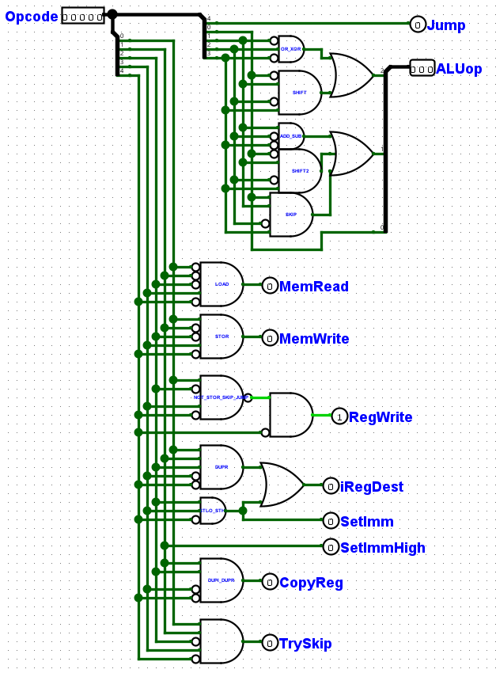
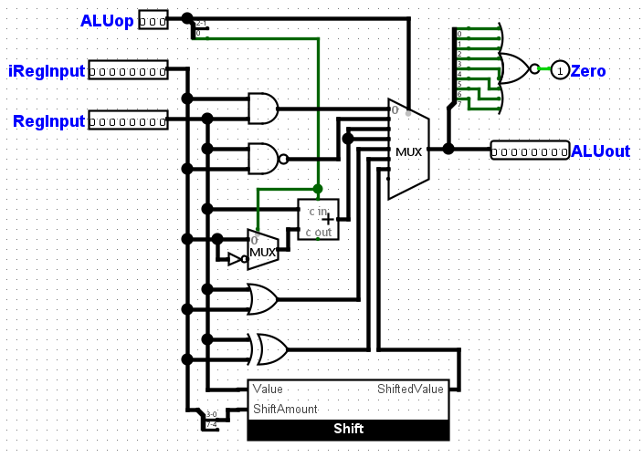
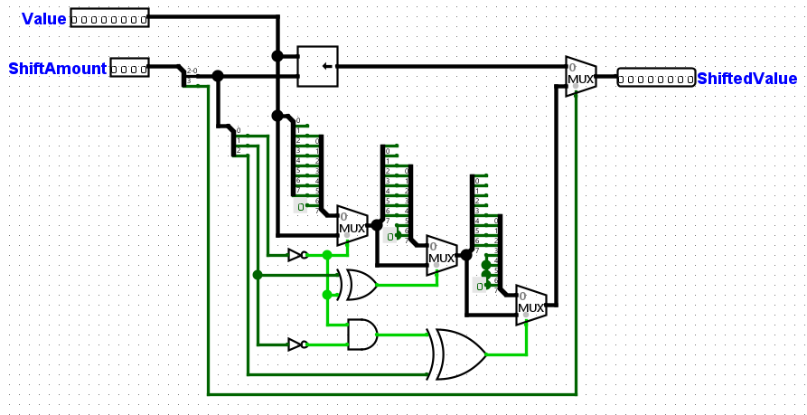

# RISC-MC8 CPU  

ISA version 4.5  
CPU version 1.0  

---

## The ISA

The RISC-MC8 ISA is a load-store instruction set architecture created entirely of 8-bit instructions.  

The following operations are supported:  
* Bitwise AND, NAND, OR, and XOR  
* Integer addition and subtraction  
* Register value copying  
* Logical bit shifting  
* Memory load and store  
* 4-bit set immediates  
* Skip next instruction if equals  
* Unconditional relative jump (signed 7-bit offset)  

The ISA provides for 8 general purpose registers, each with a size of 8 bits. No zero register exists, zero may be acquired using `XORI ireg`.  

In order to meet the instruction bit length requirements, only one register is used as the argument for each instruction.  
Math and bitwise instructions use `ireg` as an implicit argument, and store the result in the register argument. (For subtraction, `ireg` is the subtrahend).  
Other instructions also use `ireg`, their usage varies. See the ISA document for details.  

Conditional branching is achieved via a `SKIP` instruction. If `ireg` equals the value in the argument register, the next instruction is skipped.  
Combining one or more `SKIP` instructions with one or more `JUMP` instruction allows for the creation of arbitrarily complex branching.  

For complete information about the ISA, refer to the ISA document in the resources directory.  

---

## The CPU

The resources directory contains a .circ and .litematic file. These correspond to a Logisim and Minecraft implementation.  
* To view the Logisim CPU, download Logisim-Evolution [here](https://github.com/logisim-evolution/logisim-evolution/releases/tag/v3.8.0).  
* To view the Minecraft CPU, download the Litematica mod [here](https://www.curseforge.com/minecraft/mc-mods/litematica/files) to allow loading the schematic into an existing Minecraft world.  

Both of these CPUs have been preloaded with the compiled testcode.asm (available in the resources directory).  

ISA version 4.5 provides for optional memory-mapped IO using memory addresses 0x00 and 0x01. For simplicity, neither the Logisim nor Minecraft CPU supports this feature.  

---

## Tools 

The tools directory contains tools necessary for preparing code to be used on these CPUs.  

#### assemble-risc-mc8
* Usage: `assemble-risc-mc8 <source.asm> <output.o>`  
* This program is used to assemble RISC-MC8 assembly into a binary file consisting of 8-bit instructions.  
* A README in the tools directory explains syntax details.  
* The source code for this program is in the RISC-MC8 Assembler directory.  

#### generate-mc-schematic.py  
* Usage: `python generate-mc-schematic.py <assembled file> <schematic file>`  
* This program is be used to convert assembled RISC-MC8 code into a Minecraft WorldEdit mod schematic file. The file may be pasted into the Minecraft CPU's instruction ROM to be run.  

---

## Media  

If media is not displayed correctly, they may be found in the media directory.  

#### Logsim CPU  

 
 
 
 

#### Minecraft CPU  

 
 
 
 
<video width="800" controls poster="media/minecraft/risc-mc8-thumb.png"><source src="media/minecraft/showcase.mp4" type="video/mp4"></video>
